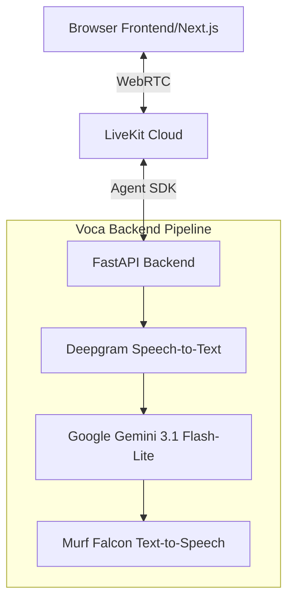

# Voca

**The Voice Layer for Every Conversation on Earth**

Voca provides real-time conversational voice agents for fast browser-based demos. It unifies speech-to-text (STT), large language models (LLM), and text-to-speech (TTS) directly over WebRTC, enabling sub-second audio responses without telephone dialing.

## Features

- **Real-Time Voice Pipeline:** Under 130ms latency for seamless conversations.
- **Multilingual Support:** Voca understands and speaks 35+ languages natively.
- **AI Personas:** Aura (Hospital), Nova (University), and Apex (Startup).
- **WebRTC Powered:** Built on LiveKit for instant browser-based audio streaming.
- **Dynamic Frontend:** Stunning UI with Framer Motion, audio-level reactive visual auras.
- **Comprehensive Dashboard:** Session tracking, expandable summaries, and metadata metrics.

## Architecture



## Setup Instructions

1. **Clone the repository:**
   ```bash
   git clone <repository_url>
   cd voca
   ```

2. **Backend Setup:**
   ```bash
   cd backend
   python -m venv .venv
   .venv\Scripts\Activate.ps1
   pip install -r requirements.txt
   ```

3. **Frontend Setup:**
   ```bash
   cd frontend
   npm install
   ```

## Environment Variables

Create a `.env` file in the `backend` directory with the following keys:

```ini
# LiveKit Configuration
LIVEKIT_URL=your_livekit_url
LIVEKIT_API_KEY=your_api_key
LIVEKIT_API_SECRET=your_api_secret

# AI Providers
GEMINI_API_KEY=your_gemini_api_key
DEEPGRAM_API_KEY=your_deepgram_api_key
MURF_API_KEY=your_murf_api_key
```

## Routes

### Frontend Pages
- `/` - Landing Page
- `/app` - Main Voice Demo App 
- `/dashboard` - Overview of session stats and history
- `/about` - About the project and Tech Stack

### Backend API
- `GET /personas` - List available AI personas
- `GET /livekit/token` - Get WebRTC connection token
- `POST /livekit/session/end` - End session and generate AI summary
- `GET /api/dashboard/sessions` - Retrieve all recorded sessions
- `GET /api/dashboard/sessions/stats` - Retrieve aggregate statistics

## Builder

Built by **Mohan Prasath** for the Murf AI Voice Hackathon — March 18, 2026.

Voice-First AI Applications
